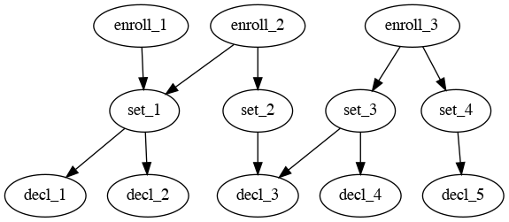

# KMFDDM

[](https://github.com/jessepeterson/kmfddm/actions/workflows/on-push-pr.yml) [](https://pkg.go.dev/github.com/jessepeterson/kmfddm)

KMFDDM is an Apple Declarative Device Management (DDM) server. It works together with open source MDM servers.

## EXPERIMENTAL

**WARNING:** KMFDDM is *experimental*. At this time it is considered an R&D platform to further understand and study the DDM protocol and device operation. The code is unpolished and virtually undocumented. *Expect* APIs to be removed and changed. Expect data models, database schemas, or whole management paradigms to change drastically. Expect to have to erase any configurations and start anew. Expect the whole project to to be non-functional at any given time.

Thanks [@chilcote](https://github.com/chilcote) for the name idea. 😉

## Requirements

- A working NanoMDM v0.3.0+ or MicroMDM v1.11.0+ environment
- Network access to and from the MDM instance(s)
- Declarative Device Management (DDM) capable device(s): iOS 15.0+, macOS 13.0+ (Ventura), etc.
- Python 3 and shell script tools are included (technically optional, but helpful)

## Getting started & Documentation

Please read this README before proceeding to the quickstart guide. It will lay some conceptual groundwork about how KMFDDM operates and some assumptions that are made.

- [Quickstart](docs/quickstart.md)  
A guide to get KMFDDM up and running quickly.

- [Operations Guide](docs/operations-guide.md)  
A brief overview of the various switches, options, and ways of working with the KMFDDM server.

## Getting the latest version

* Release `.zip` files containing the server and scripts should be attached to every [GitHub release](https://github.com/jessepeterson/kmfddm/releases).
  * Release zips are also [published](https://github.com/jessepeterson/kmfddm/actions) for every `main` branch commit.
* A Docker container is built and [published to the GHCR.io](http://ghcr.io/jessepeterson/kmfddm) registry for every release.
  * `docker pull ghcr.io/jessepeterson/kmfddm:latest` — `docker run ghcr.io/jessepeterson/kmfddm:latest`
  * A Docker container is also published for every `main` branch commit (and tagged with `:main`)
* If you have a [Go toolchain installed](https://go.dev/doc/install) you can checkout the source and simply run `make`.

## Concepts & Terms

### Declaration

If you're not familiar with what a declaration is (or DDM for that matter) please check out Apple's first WWDC 2021 video ["Meet declarative device management."](https://developer.apple.com/videos/play/wwdc2021/10131/).

Declarations are JSON blobs which include `Identifier`, `Type`, and `Payload` fields. An additional field, `ServerToken`, uniquely identifies a "version" of a declaration, but KMFDDM takes care of this field for you. The `Identifier` is whatever unique value you like, and the contents of the `Payload` object field is defined by the type of declaration (as specified in the `Type` field). The various types and payloads are [documented by Apple](https://developer.apple.com/documentation/devicemanagement/declarations). Here's an example declaration:

```json
{
    "Type": "com.apple.management.organization-info",
    "Payload": {
        "Name": "ACME Widgets Co."
    },
    "Identifier": "c55aad00-126f-4ed4-be8a-df58d5856c97"
}
```

As an aside this was generated using the included [ideclr.py](tools/ideclr.py) tool:

```sh
$ ./tools/ideclr.py org-info 'ACME Widgets Co.'
```

Further aside: I don't actually recommend using UUIDs for the `Identifier` field (for your own sanity) — it's just a default here. `ideclr.py` has the `-i` switch to specify your own.

### Tokens

Declarative Device Management has two (and a half) different "tokens." One of these is the declaration `ServerToken` field which uniquely identifies a "version" of a declaration. When a declaration changes this field signifies if a declaration is out of date on the enrolled device (as compared to what the server has provided). This field is managed for you in KMFDDM and is updated every time you add a new or update and existing declaration. As an implementation detail it is a hash of the values of the fields in the declaration.

The other token (or rather one and a half) is the `DeclarationsToken` that is part of both the Declaration Items and the Device Token (or just Token). Similar to the declaration this token identifies whether the enrolled device's collection of declarations is out of date and whether it needs to update the declarations from the server. This token (which is actually the same for Declaration Items and the Device Token) is also managed for you and, as an implementation detail, is derived from the `ServerToken`'s of each of the Declarations included in an enrollment's Declaration Items.

### Declaration Items and Device Token

Per the DDM protocol the Declaration Items (and the closely related Device Token or just Token) is the *collection* of declaration `Identifier`'s and declaration `ServerToken`'s for the specific enrollment. Per above they also include their own separate server token value. In KMFDDM the Declaration Items (and Device Token) are "composited" from all of an enrollment's assigned sets (and thus declarations). More on this below.

### Sets

A "set" in KMFDDM is a named collection of declarations. Declarations have a many-to-many relatipnship with sets: that is, a declaration can be "in" many different sets and sets can contain many different declarations. Sets can be thought of as "logical" collections of declarations. Another way to think of them is "named" Declaration Items. Sets, by themselves, are "free standing" and not automatically related to enrollments or enrollment IDs.

### Enrollments

Sets can be associated with [NanoMDM Enrollment IDs](https://github.com/micromdm/nanomdm/blob/main/docs/operations-guide.md#enrollment-ids) in a many-to-many relationship: that is enrollment IDs can be associated with many sets and sets can be associated to many enrollment IDs. Of note is that *declarations cannot be associated directly to enrollment IDs*. Declarations can only be associated with sets.

## Compositing

Thanks to the associations of sets and enrollments described above KMFDDM dynamically "composits" the collection of declarations into a single Declaration Items for an enrollment ID. In this way we can support a flexible configuration of declaration-to-enrollment mappings. Such as:

- Declarations (contained in sets) intended for all enrollments
- Declarations (contained in sets) intended for groups of enrollments such as:
  - Business units, departments, teams, etc.
  - Logical or functional groupings. E.g. for specific configurations or settings.
- Declarations (contained in sets) intended for only a single enrollment
  - Notably this allows support for per-enrollment management properties

These associations also work in reverse to power the enrollment ID "resolution" when e.g. a single declaration is modified KMFDDM knows how to find all the applicable enrollment IDs to notify with the DM command.

Visually this looks a bit like:



In this example we can see (among other possible combinations):

- `enroll_1` will "composite" a Declaration Items that includes `decl_1` and `decl_2` and no others.
- `enroll_2` will include `decl_1`, `decl_2`, and `decl_3` and no others.
- `enroll_3` will include `decl_3`, `decl_4`, and `decl_5` and no others.

In the case of modifications:

- if `decl_1`, `decl_2`, or `set_1` are modified then `enroll_1` and `enroll_2` would be notified.
- if `decl_3` is modified then `enroll_2` and `enroll_3` would be notified.
- if `set_2` is modified then `enroll_2` would be notified.
- if `set_3` is modified then `enroll_3` would be notified.
- if `decl_4`, `decl_5`, `set_3`, or `set_4` were modified then *only* `enroll_3` would be notified.

**You will have to maintain what sets are assigned to which individual enrollment IDs** (and, of course, which individual declarations are assigned to which sets). But once you do KMFDDM takes care of the rest.

## Features

- Token management.
  - The version/change "tokens" in Declarations, Declarations Items, and Device Tokens are all managed for you.
  - Tokens are created, updated, and generated for you. You just update your "assignments" and your declarations and KMFDDM takes care of the rest.
- Auto-notification.
  - Devices are automatically notified (that is, sent the `DeclarationManagement` MDM command) when associations or declaration content changes.
  - This includes transitively notifying devices for whom dependencies change.
  - For single enrollment notifications we include the device tokens directly in the `DeclarativeManagement` command.
- Status channel data "cache."
  - We store enrollment declaration status and errors for later retreival and insepction.
  - We store all non-declaration, non-error data as "values" for later retrieval and insepction. This is useful to inspect what declarations or status subscriptions are supported by an enrollment.
- Restricted declaration retrieval.
  - By way of table joins we only retrieve declarations (transitively) associated to an enrollment ID. I.e. enrollments cannot access declarations not intended for them. A bit like an ACL. Sort of.
  - Not a design goal per se, just a happy accident.

## Warnings and caveats

- Enrollment ID set associations are "forever."
  - Once you assign an enrollment ID to a set it is forever assigned until you unassign it.
  - If a device is unenrolled or otherwise becomes unmanaged in NanoMDM it will still receive notifications (queued MDM commands) from KMFDDM.
  - You "unenroll" a device from KMFDDM by dissociating the enrollment ID from any sets via the API. Keep in mind this does not turn off DDM for an enrollment — this merely stops future notifications.
  - This will also notify the device that it has 0 declartions to manage anymore. This is as good as DDM "unenrollment" can get.
- You can trivially create invalid sets of declarations.
  - Not much vetting is done as far as references to declarations from other declarations *within sets*. I.e. you can add a declaration to a set that references another declaration that *is not* in that set. This would end up as an error reported by enrollments if another set did not contain that missing declaration.
  - However most declaration model problems will be reported back to you on the DDM Status Report channel. Each enrollment's actively managed Declaration Items status is saved and can be retrieved and inspected.
  - But still: pay attention to what's assigned where.
- Shell scripts can be confusing.
  - Most of the shell script tools take positional arguments and its not always obvious which positional argument is what. Especially with regard to the "association" scripts.
  - Generally the the first argument follows the first entity in the filename. For example `api-set-declarations-put.sh` would be about the association between sets and declarations with the first argument being the set name and the second the declaration Identifier.
- Over-notification.
  - Due to the use of `ON DUPLICATE KEY` in the SQL we can't always accurately tell which enrollments *don't* need to be notified. Therefore when changes happen to declarations or sets we may over-notify some (or a lot of) enrollments.
  - However this isn't *technically* a problem because the "tokens" architecture of the DDM protocol will not consider the declarations actually changed. It's just a potential waste of MDM command and DDM token & round-trips to be aware of.
